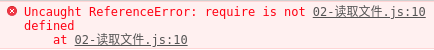

> 没有BOM和DOM.js

- 在 Node 中，采用 EcmaScript 进行编码
- 没有 BOM、DOM
- 和浏览器中的 JavaScript 不一样

```javascript
console.log(window)
console.log(document)
```

```bash
$node 01-没有bom和dom.js 
ReferenceError: window is not defined
ReferenceError: document is not defined
```

测试结果：报错

1. 使用 require 方法加载 fs 核心模块

- 浏览器中的 JavaScript 是没有文件操作的能力的
- 但是 Node 中的 JavaScript 具有文件操作的能力
- fs 是 `file-system` 的简写，就是文件系统的意思
- 在 Node 中如果想要进行文件操作，就必须引入 fs 这个核心模块
- 在 fs 这个核心模块中，就提供了所有的文件操作相关的 API
- 例如：`fs.readFile` 就是用来读取文件的

```bash
var fs = require('fs')
```

2. 读取文件

- 第一个参数就是要读取的文件路径
- 第二个参数是一个回调函数
    - 成功
        - data 数据
        - error null
    - 失败
        - data undefined没有数据
        - error 错误对象

```javascript
fs.readFile('./data/a.txt', function (error, data) {
  // console.log(data)
  // console.log(error)
  // console.log(data)
  // 在这里就可以通过判断 error 来确认是否有错误发生
  if (error) {
    console.log('读取文件失败了')
  } else {
    console.log(data.toString())
  }
})
```

如果不加data.toString()，则会出现以下乱码

```
<Buffer 68 65 6c 6c 6f 20 6e 6f 64 65 6a 73 0d 0a>
```

- 文件中存储的其实都是二进制数据 0 1
- 这里为什么看到的不是 0 和 1 呢？原因是二进制转为 16 进制了
- 但是无论是二进制01还是16进制，人类都不认识
- 所以我们可以通过 toString 方法把其转为我们能认识的字符

> 读取文件.js

```javascript
var fs = require('fs')
fs.readFile('./data/a.txt', function (error, data) {
  if (error) {
    console.log('读取文件失败了')
  } else {
    console.log(data.toString())
  }
})
```

> 浏览器是不认识node代码的.html

```html
<!DOCTYPE html>
<html lang="en">
<head>
  <meta charset="UTF-8">
  <title>Document</title>
</head>
<body>
  <!-- <script src="00-helloworld.js"></script> -->
  <!-- <script src="01-没有bom和dom.js"></script> -->
  <script src="02-读取文件.js"></script>
</body>
</html>
```

