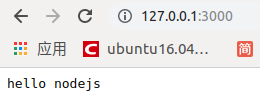

```javascript
var http = require('http')
var server = http.createServer()
```

request 请求事件处理函数，需要接收两个参数：

- `Request`请求对象
    - 请求对象可以用来获取`客户端`的一些请求信息，例如请求`路径`
- `Response`响应对象
    - 响应对象可以用来给`客户端`发送`响应消息`

```javascript
server.on('request', function (request, response) {
```

- http://127.0.0.1:3000/ `/`
- http://127.0.0.1:3000/a `/a`
- http://127.0.0.1:3000/foo/b `/foo/b`


```javascript
console.log('收到客户端的请求了，请求路径是：' + request.url)
```

```bash
$node 06-http-res.js 
服务器启动成功了，可以通过 http://127.0.0.1:3000/ 来进行访问
收到客户端的请求了，请求路径是：/
收到客户端的请求了，请求路径是：/a
收到客户端的请求了，请求路径是：/foo/b
```

- response 对象有一个方法：write 可以用来给客户端发送响应数据
- write 可以使用多次，但是最后一定要使用 `response.end()` 来结束响应，否则客户端会一直等待

```javascript
response.write('hello')
response.write(' nodejs')
```



- 告诉客户端，我的话说完了，你可以呈递给用户了

```javascript
response.end()
```

- 由于现在我们的服务器的能力还非常的弱，无论是什么请求，都只能响应 hello nodejs
- 思考
    - 我希望当请求不同的路径的时候响应不同的结果
- 例如
    - `/` index
    - `/login` 登陆
    - `/register` 注册
    - `/haha` 哈哈哈

```javascript
server.listen(3000, function () {
  console.log('服务器启动成功了，可以通过 http://127.0.0.1:3000/ 来进行访问')
})
```

> 完整代码演示http-res.js

```javascript
var http = require('http')
var server = http.createServer()

server.on('request', function (request, response) {
  console.log('收到客户端的请求了，请求路径是：' + request.url)
  response.write('hello')
  response.write(' nodejs')
  response.end()
})

server.listen(3000, function () {
  console.log('服务器启动成功了，可以通过 http://127.0.0.1:3000/ 来进行访问')
})
```